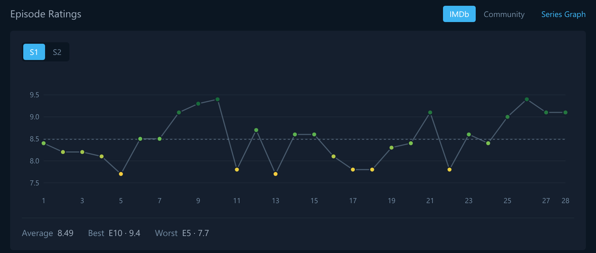

# Episode Ratings for AniList

A Chrome extension that adds a per-episode rating chart to AniList anime pages, using
data from [Series Graph](https://seriesgraph.com).

The panel sits at the top of the Overview column, above Relations, and follows
AniList's light / dark / contrast theme.



- **IMDb / Community toggle** — Series Graph carries both IMDb ratings and its own
  users' ratings; switch between them.
- **Season picker** — for shows TMDB files as several seasons.
- **Hover any episode** for its title, rating, vote count and air date.

## Install

Not on the Chrome Web Store — installing takes about a minute.

**1. Download it**

[**episode-ratings-for-anilist.zip**](https://github.com/anas1412/series-graph-for-anilist/releases/latest/download/episode-ratings-for-anilist.zip)
— always the latest release.

**2. Unzip it**

Put the folder somewhere you will not delete by accident. Chrome loads the extension
from that folder every time it starts, so it has to stay put.

**3. Load it into Chrome**

1. Go to `chrome://extensions`
2. Turn on **Developer mode** — top right
3. Click **Load unpacked**
4. Select the unzipped folder

Then open any anime page on AniList. The chart appears at the top of the Overview
column, above Relations.

> Dragging the `.zip` onto `chrome://extensions` does not work — Chrome only accepts
> packed `.crx` files that way. Unzip first.

Works in any Chromium browser: Chrome, Edge, Brave, Opera, Vivaldi.

**Updating** — download the new zip, replace the folder's contents, then hit the
refresh icon on the extension's card in `chrome://extensions`.

### Building it yourself

```bash
git clone https://github.com/anas1412/series-graph-for-anilist
cd series-graph-for-anilist
node scripts/package.mjs   # writes dist/episode-ratings-for-anilist.zip
```

Or skip the zip entirely and **Load unpacked** straight from the cloned folder. There is
no build step — it is plain ES modules and one classic content script.

Notes on publishing to a store, if you ever want to, are in
[docs/STORE-LISTING.md](docs/STORE-LISTING.md).

## How it works

```
AniList page  →  anilist id
                     │
                     ├─ data/anilist-tmdb.json ......  TMDB show id + a season hint
                     ├─ graphql.anilist.co .........  format, episode count, start date
                     └─ seriesgraph.com/api ........  every season's episode ratings
                                    │
                              pickSeason()  ..........  which season is this page?
                                    │
                              the chart
```

All three lookups happen in the service worker, not the content script — the Series
Graph endpoint sends no `Access-Control-Allow-Origin` header, and content-script
fetches are subject to CORS under Manifest V3. Responses are cached in
`chrome.storage.local` for 24 hours.

### The hard part: which season is this page?

AniList files each cour as its own entry. TMDB files them as seasons of one show. So
"Sousou no Frieren 2nd Season" and "Sousou no Frieren" are two AniList pages pointing
at one TMDB show, and the extension has to work out which season each page means.

The bundled mapping carries a season number, but it is wrong often enough to matter —
it puts Frieren's second season on TMDB season 1. So that number is treated as a prior,
and AniList's own episode count and start date decide when they point elsewhere.
[`src/season.js`](src/season.js) has the scoring.

Measured over the 200 most popular TV entries on AniList:

| | |
|---|---|
| multi-season shows judged | 134 |
| correct season | **134** |
| single-season (nothing to get wrong) | 58 |
| too sparsely dated on Series Graph to judge | 8 |
| no mapping or no Series Graph data | 0 |

Run it yourself with `node test/season-alignment.mjs`. It hits live APIs and takes a
few minutes.

### Coverage

`data/anilist-tmdb.json` maps 6,837 AniList ids, which is 72% of all TV-format anime —
but every one of the 200 most popular TV entries is covered, so in practice you will
rarely hit a gap.

The panel simply does not appear when it cannot be sure what it would be showing:

- no mapping entry, or Series Graph has no data for the show
- movies, one-shot specials and single-episode entries — they share the parent show's
  TMDB id, so charting them would show the TV series' episodes
- the season cannot be identified with any confidence. 21% of mapping entries point at
  TMDB's specials season, which Series Graph never returns, and the mapping sometimes
  names a season that does not exist. In those cases only an air-date match can confirm
  a guess; a matching episode count on its own cannot. Kemono Friends 2 has twelve
  episodes and so does the only season Series Graph holds for it — one that finished
  two years before this entry began.

## Development

```bash
node scripts/build-mapping.mjs      # rebuild data/anilist-tmdb.json from Fribb's anime-lists
node test/service-worker.mjs        # run the service worker end to end, chrome.* stubbed
node test/season-alignment.mjs      # check season picking against 200 popular anime
node test/fetch-fixtures.mjs        # pull real data for the preview page
node scripts/package.mjs           # build dist/*.zip for the Chrome Web Store
node scripts/store-assets.mjs      # regenerate store screenshots and promo tiles
```

`test/service-worker.mjs` is the one that matters day to day: it imports the real
service worker with a stubbed `chrome` API and checks the whole path — mapping lookup,
both fetches, caching, season picking, movies being refused, network failures
surfacing as errors rather than being cached, and byte-aware eviction under a
deliberately tight storage quota.

`test/preview.html` renders the panel against AniList's real colour variables in all
three themes, for a handful of awkward shows — a 1,176-episode season, a split cour, a
season with community ratings but no IMDb ones. Serve the folder and open it:

```bash
npx http-server . -p 8123
```

Nothing is bundled or compiled. The extension is plain ES modules and one classic
content script.

## Caveats

- Series Graph's API is undocumented. It could change or start refusing requests at
  any time, and this extension is not affiliated with them. It makes one request per
  show, cached for a day.
- For a split-cour entry, the chart shows the whole TMDB season, which includes the
  other cour's episodes. Series Graph shows the season the same way.
- Older shows often have almost no air dates on Series Graph, which is what the eight
  unjudgeable rows above are. Season picking falls back to the bundled mapping there.

## Data

Ratings and episode data from [Series Graph](https://seriesgraph.com), which draws on
IMDb, TMDB and its own users. Id mapping from
[Fribb/anime-lists](https://github.com/Fribb/anime-lists). Episode counts and air dates
from the [AniList API](https://anilist.gitbook.io/anilist-apiv2-docs/).
